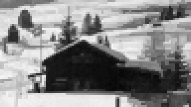
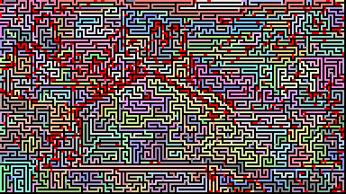

# Mino Image Compressor

An experimental image format by Dirk Plate. 

## Concept

## Demo

Try out the [Demo](https://dplate.github.io/mino).

It shows the original image, the compressed (by decompressing it again) and an visualisation of the steps (colored lines) and anchors (red dots).

It also offers a download link to the compressed file, which can be later decompressed again on the same demo page.

### Main idea

The idea is to use only one bit, if the next pixel is lighter or darker. The next pixel is chosen by the least difference, but it must be a neighbour pixel (up, right, bottom or left). Because every pixel is created by a previous pixel, there are at maximum three directions possible for the next step (to reach the next pixel). In most cases there are even fewer directions possible, because of the image limits or because other neighbours were already visited. This results in only around 0.8 bit required in average to save the direction. That works, because during decompression the same steps are executed and therefore it is also know, which directions are still possible. In total every step needs 1.8 bits.

### Avoiding dead ends

Sadly there is not always a neighbour left, because the steps reached a dead end. In that case an alternativ path is searched by going the steps backwards until a pixel with unvisited neighbours are found (there is some more logic to prefer pixels with more than one neighbour implemented). Because the same algorithm is used for decompressing, these way back from a dead end does not need any additional bits.

### Labyrinth

Since at the end every pixel of the image is reached by a step from a previous pixel, it builds a path which covers the whole image - a big labyrinth.

### Anchors

Because most images does not contain of smooth gradients, but also have some sharp contrasts, there is another optimization necessary - called "anchors". If the difference to the next pixel exceed a specific threshold, then this step is saved as a new anchor, meaning the target pixel value is saved completely. These anchors are saved together with the step number in a separate list. There is not much compression possible, which means several bytes per anchor. 

### Image size

It depends highly on the images, how many anchors are necessary, while the amount of steps are constant (one step for every pixel). That means in optimal case the compressed images size is `width * height * 1.8bit`. In worst case additional an anchor for every step, which would break the whole idea.

## FAQ

### Is the compression lossy?

For most pictures, yes. But the step size can be changed to 1, and the error threshold can be changed to 0. Then there would be no loss, but the size will be very big, because of the many required anchors.

### Is the compression better than any common image format?

Better than a pure bitmap file, but worse than probably every other format, like jpg or png.

### Can it only compress gray scale images

The prototype compresses only one channel to make it easier. It could be extended to compress every channel of an image, which would result in a three times bigger image. Probably it would be worth to compress not RGB channels, but YUV instead to avoid sharp contrasts.

### Is it fast?

The prototype is developed in pure Javascript with readable code in mind: so no.

### Should I use it for production?

Hell, no

### Should I use it?

No

### Why does it exist then?

I just had the idea for the algorithm and wanted to try it out. Technical it works, and it was fun to develop - but it was just not a very good idea.

### Why is is called Mino?

Basically a labyrinth is used for the compression. And the most famous labyrinth was built around the **Mino**taurus.